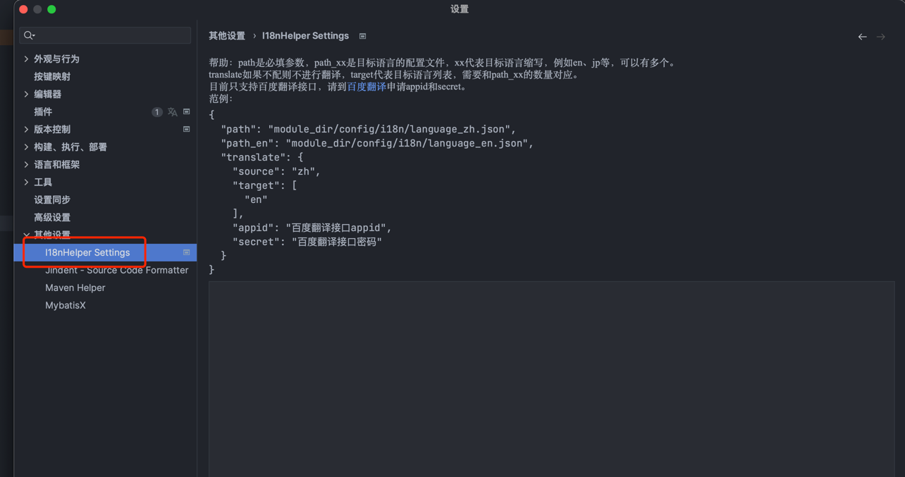

[中文](README.md) / English

<p align="left">
    <a href="https://opensource.org/license/gpl-3.0/" alt="License">
        </a>
<a target="_blank" href="https://join.slack.com/t/neatlogichome/shared_invite/zt-1w037axf8-r_i2y4pPQ1Z8FxOkAbb64w">
</a>
</p>

---

## Features

Automatically convert selected text to a key in i18n. If the Chinese text does not exist, it will automatically write
the key and text content into the corresponding i18n configuration file, and complete the target language translation.

## Requirements

This plugin requires that the i18n language file is in json format, for example:

language_zh.json:

``` json
{
"name":"name",
"age":"age"
}
```

## Usage

### Edit the language file path



### Configure shortcut keys


### Select text and replace

Select any text in the editor, use the shortcut key to complete the replacement. If the key does not exist, you need to
input a new key.
