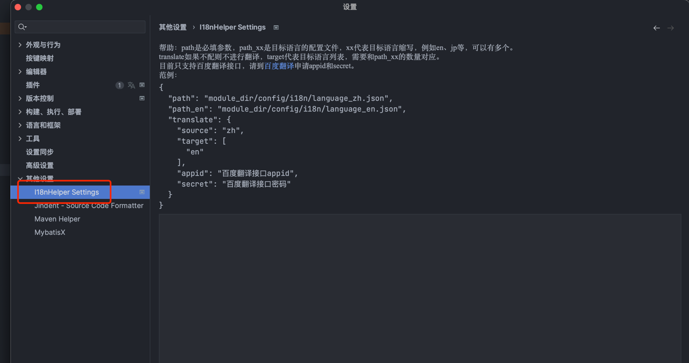
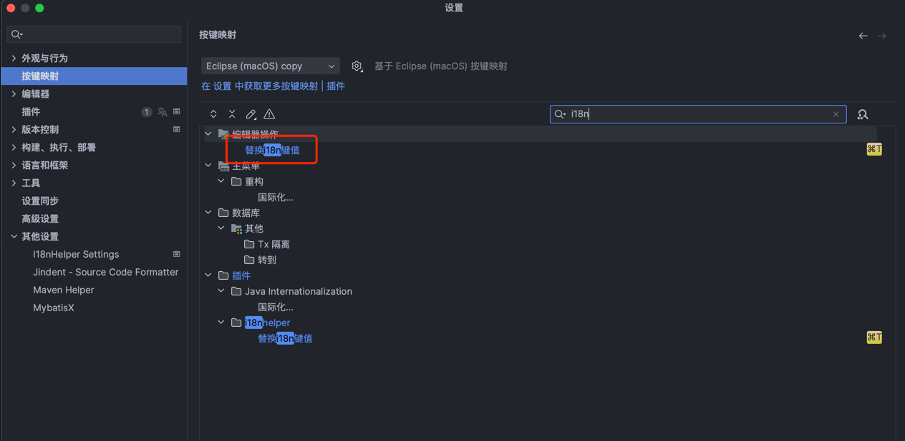

中文 / [English](README.en.md)

<p>
    <a href="https://opensource.org/license/gpl-3.0/" alt="License">
        </a>
<a target="_blank" href="https://join.slack.com/t/neatlogichome/shared_invite/zt-1w037axf8-r_i2y4pPQ1Z8FxOkAbb64w">
</a>
<a target="_blank" href="https://plugins.jetbrains.com/plugin/21921-i18nhelper"></a>
</p>

---

## 功能

<!-- Plugin description -->
自动转换选中文本为i18n中的key，如果中文不存在，则自动往对应的i18n配置文件中写入key和文本内容，并完成目标语言翻译。

---

Automatically convert selected text to a key in i18n. If the Chinese text does not exist, it will automatically write
the key and text content into the corresponding i18n configuration file, and complete the target language translation.

<!-- Plugin description end -->

## 使用要求

本插件要求i18n语言文件是json格式，例如

language_zh.json:

``` json
{
"name":"名称",
"age":"年龄"
}
```

## 使用方式

### 编辑语言文件路径



### 配置快捷键



### 选中文本并替换

在编辑器中选中任意文本，使用快捷键即可完成替换，如果key不存在，需要输入新的key

